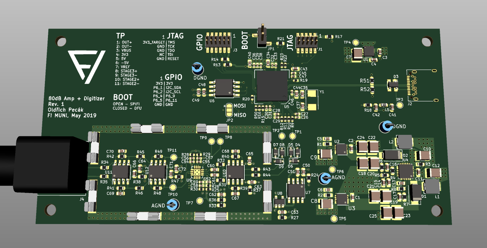

# EmLab Amp HW
Hardware for 80dB amp + digitizer

## Notes
- the TPS65131 regulator does some weird stuff - maybe exchange for similar AD part?

## TODO
- debug prototype

### Schematic
- nothing

### PCB
- nothing

## Links
- [BOM](https://octopart.com/bom-tool/Xo4yGKYB)
- [LPC Link 2 Schematic](https://www.nxp.com/downloads/en/schematics/LPC-Link2-SCH.pdf)
- [BGA PCB Guidelines](https://www.nxp.com/docs/en/application-note/AN10778.pdf)
- [Proper grounding #1](https://www.analog.com/en/analog-dialogue/articles/staying-well-grounded.html)
- [Proper grounding #2](https://www.maximintegrated.com/en/app-notes/index.mvp/id/5450)
- [LPC4370 Datasheet](https://www.nxp.com/docs/en/data-sheet/LPC4370.pdf)
- [W25Q80BVSSIG Datasheet](https://openwrt.org/_media/media/datasheets/flash/w25q80bv.pdf)
- [IS25LP080D-JNLA3-TR](https://cz.mouser.com/ProductDetail/ISSI/IS25LP080D-JNLA3-TR?qs=sGAEpiMZZMuIiYGg9i1FDOSOPk6CUsSSrSt5PkokTOpe%2F19c4PAU8Q%3D%3D)
- [LT3094 Datasheet](https://www.analog.com/media/en/technical-documentation/data-sheets/LT3094.pdf)
- [LT3045 Datasheet] (https://www.analog.com/media/en/technical-documentation/data-sheets/3045fa.pdf)
- [TPS7A80 Datasheet](http://www.ti.com/lit/ds/symlink/tps7a80.pdf)
- [THS4131 Datasheet](http://www.ti.com/lit/ds/symlink/ths4131.pdf)
- [LMH6518 Datasheet](http://www.ti.com/lit/ds/symlink/lmh6518.pdf)
